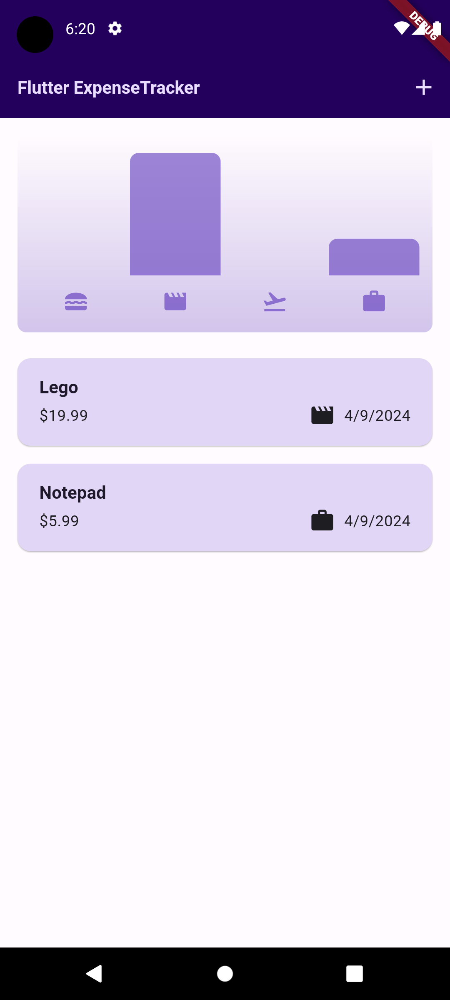
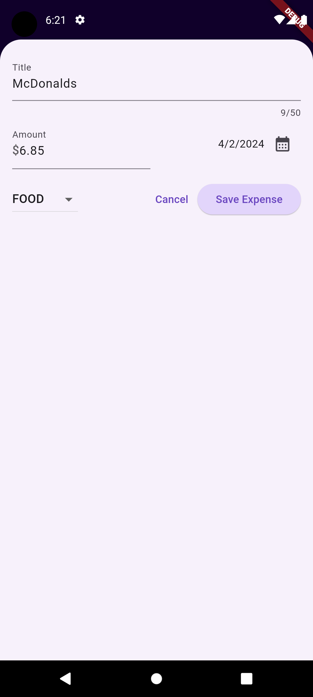
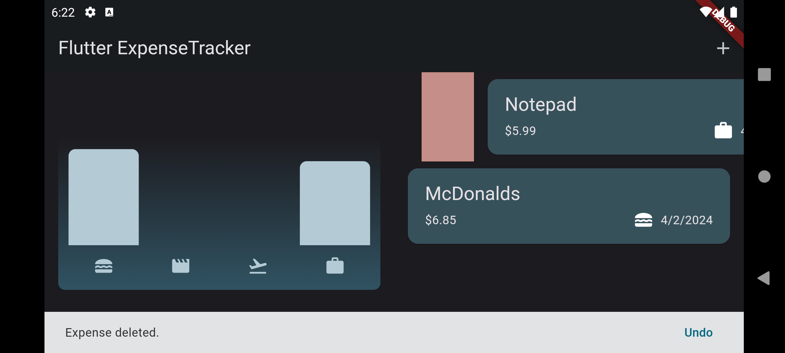

# expense_tracker

An app designed to help you manage your expenses. Project utilises theming, state management, various inputs, data models and adaptiveness. It does not support pernament data storage for now.

## Screenshots

 

